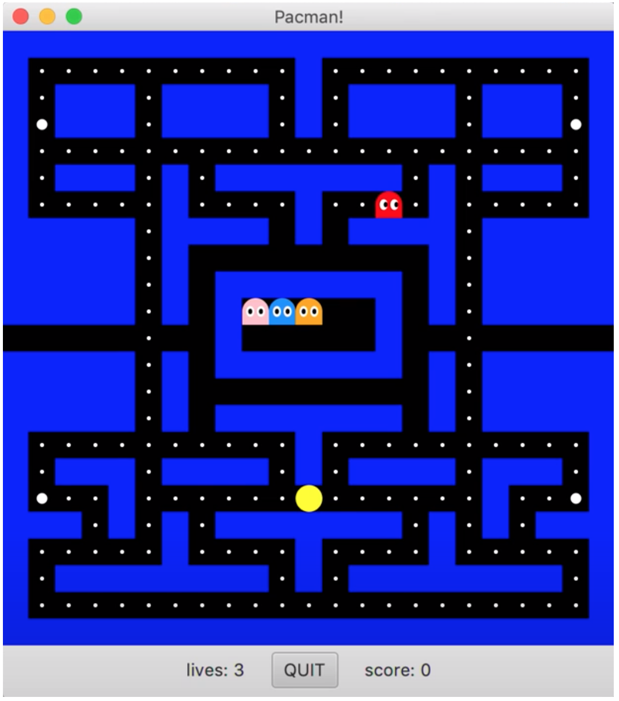

# Portfolio

---

## Team Projects

<a href="https://pez-globo.org">Pufferfish Ventilation (Pez Globo)</a>: An Open-source ventilator project. Pufferfish aims to fight the COVID-19 health crisis by creating a fully open source, FDA-approved ventilator with easily sourced parts.
    <ul>
        <li>
            I designed on the ventilator's interface PCB which serves as the interface between front-end user devices and the control MCU.
        </li>
    </ul>
KiCAD Samples (for more, see <a href="https://github.com/pez-globo/pufferfish-electronics/tree/interface">GitHub Interface Branch</a>)

<a href="https://github.com/pez-globo/">GitHub Organization Link</a>

 
 

<a href="https://brownspace.org">Brown Space Engineering</a>: A team of undergraduates building open-source CubeSats, to bring space to the people. Our first satellite, <a href="https://brownspace.org">EQUISat</a>, launched in 2018, with 2 missions--to create a flash that can be seen from Earth and to test novel LiFePO4 batteries in space for the first time.
    <ul>
        <li>
            I am the Avionics Hardware leader of Brown Space Engineering. I lead and manage a team of 10 undergrads to create the electronics systems of our satellites--radio, power, and control. I also work the other leads to ensure cohesive integration of all subsystems.
        </li>
        <li>
            As we begin the process of making a new satellite, my team and I are working on a launch application to NASA that describes its mission and technical specifications and requirements.
        </li>
        <li>
            Our next satellite's mission is to be 1) an interactive satellite that can display anyone's message in space and 2) test perovskite solar cells for the first time in space.
        </li>
  </ul>

An example of the systems design I'm doing--high-level block diagram for our new satellite, PVDX

<a href="https://github.com/BrownSpaceEngineering">GitHub Organization Link</a>

---

## Class Projects
### Java
[Pacman](/mov/Pacman.mov)

[Tetris](/mov/Tetris.mov)  

[DoodleJump](/mov/DoodleJump.mov)

### Python
[RISC-V Assembler](/mov/Assembler.mov)

---
[Project 2 Title](/pdf/sample_presentation.pdf)
---
[Project 3 Title](http://example.com/)

---

---

Page template forked from <a href="https://github.com/evanca/quick-portfolio">evanca</a>

<!-- Remove above link if you don't want to attibute -->
