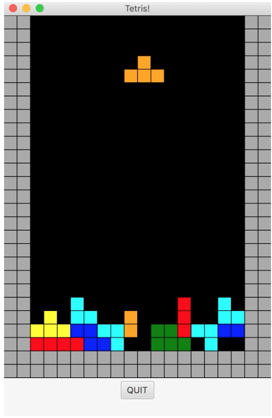

# Software
<i>Click project titles for videos</i>
 
## Python

 <b>
<a href="https://laurenadachi.github.io/mov/Assembler.mov">RISC-V Assembler</a>   </b>

 

## Java

<b>
 
<a href="https://laurenadachi.github.io/mov/Pacman.mov">Pacman</a>  
  

<a href="https://laurenadachi.github.io/mov/Tetris.mov">Tetris</a>  
   

<a href="https://laurenadachi.github.io/mov/DoodleJump.mov">DoodleJump</a>  
  
</b>

## C

 <b>
Theseus   </b>
Wrote embedded firmware in C for PerkinElmer's Theseus: a biomedical device that automates cellular biology experiments, such as polymerase chain reaction (PCR).  

   

